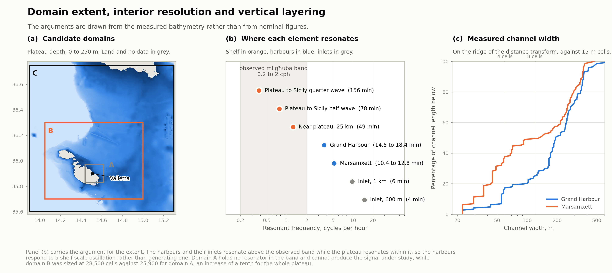

# Model domain, horizontal resolution and vertical layering: a sizing exercise

*Prepared 23 September 2026 for discussion with the host group. Computed by `scripts/domain_design_estimate.py` from the bathymetry obtained on 22 September and the coastline obtained on 23 September. Figure at `figures/domain_design.png`.*

The exercise settles three questions that precede mesh construction. The conclusions rest on measurement of the supplied bathymetry rather than on nominal figures, and each is stated so that it can be contested.

---

## 1. Measured geometry of the two basins

| | Grand Harbour | Marsamxett |
|---|---|---|
| Water area | 1.64 km² | 1.32 km² |
| Volume | 26.1 × 10⁶ m³ | 17.6 × 10⁶ m³ |
| Mean depth | 15.9 m | 13.3 m |
| Median depth | 16.0 m | 13.0 m |
| Maximum depth | 28 m | 30 m |
| Axis length | 3.22 km | 3.15 km |

Channel width was measured along the ridge of the distance transform of the water mask, which is where the distance to land equals the local half-width and the doubled value is therefore the true width. Measured anywhere else the distance transform reports proximity to the shore rather than the width of the channel, and understates it.

| Percentile of channel length | Grand Harbour | Marsamxett |
|---|---|---|
| p10 | 55 m | 29 m |
| p25 | 126 m | 45 m |
| p50 | 193 m | 135 m |
| p75 | 316 m | 271 m |
| p90 | 367 m | 361 m |

Half the channel length of Marsamxett lies in water narrower than 135 m and a third of it narrower than 50 m. The Grand Harbour is the broader of the two, with a fifth of its channel length narrower than 100 m.

---

## 2. Domain extent

*Candidate domains A, B and C over the bathymetry of the Malta Plateau (a), resonant frequency of the shelf, the harbours and the inlets against the milgħuba band of 0.2 to 2 cph (b), and cumulative distribution of the channel width in the two harbours against cells of 15 m (c).*

### The question is where the seiche energy originates

Quarter-wave periods were computed for each element of the system as T = 4L/√(gh) and set against the milgħuba band of 0.2 to 2 cph reported by Drago (2009), corresponding to periods between 30 minutes and 5 hours.

| Element | L | h | Period | Frequency | Relative to the band |
|---|---|---|---|---|---|
| Malta Plateau to Sicily, quarter wave | 90 km | 150 m | 156 min | 0.38 cph | **within** |
| Malta Plateau to Sicily, half wave | 90 km | 150 m | 78 min | 0.77 cph | **within** |
| Near plateau | 25 km | 120 m | 49 min | 1.24 cph | **within** |
| Grand Harbour | 3.2 km | 16 m | 17 min | 3.49 cph | outside |
| Marsamxett | 3.2 km | 13 m | 18 min | 3.26 cph | outside |
| A 1 km inlet | 1.0 km | 12 m | 6 min | 9.76 cph | outside |
| A 600 m inlet | 0.6 km | 10 m | 4 min | 14.86 cph | outside |

The plateau geometry was verified rather than assumed. A transect north along 14.50°E from Malta to the Sicilian coast returns depths between 99 and 190 m continuously over some 90 km, and a transect east along 35.95°N remains between 70 and 137 m as far as 15.25°E, so the Malta Escarpment lies beyond that meridian at this latitude.

**The harbours and their inlets resonate above the observed band. The plateau resonates within it.** The harbours therefore respond to a shelf-scale oscillation rather than generating one, which is consistent with Drago's interpretation of the milgħuba as the expression of shelf-scale resonance amplified within the embayments.

The consequence for the model is direct. A domain confined to the harbours contains no resonator in the band and cannot produce the signal under study. It could only receive that signal through its open boundary, and the available boundary product, CMEMS MED-MFC at hourly resolution, carries no energy in the band. Such a domain would have to be driven by the Portomaso record, which is a single coastal station outside both basins, and validating the harbour response against a signal imposed from a neighbouring gauge is close to circular.

### Provenance of the basin period, and its sensitivity

The periods above follow from T = 4L/√(gh). The depth is measured directly and is well constrained at 15 to 16 m. The length is not, and the figure reported as 3.22 km was the diagonal of a rectangle drawn by hand around the harbour rather than a measured basin length.

Measurement by geodesic distance through the water, from the entrance to the head at Marsa, returns 2.15 km. A generous alternative that admits the outer approaches returns 3.6 km. The three estimates bracket the period as follows.

| Estimate of L | L | Period | Frequency |
|---|---|---|---|
| Entrance to Marsa, measured through the water | 2.15 km | 11.6 min | 5.16 cph |
| Diagonal of the bounding rectangle | 3.22 km | 17.4 min | 3.45 cph |
| Generous, including the approaches | 3.60 km | 19.5 min | 3.08 cph |

**The conclusion does not depend on resolving the length.** The observed band reaches 2 cph, a period of 30 minutes. For the Grand Harbour to enter it at the measured depth the basin would have to be 5.55 km long, which is between 1.5 and 2.6 times its length under any of the three estimates. Alternatively, at the length of 3.22 km the mean depth would have to be 5.2 m rather than 15.5 m, a third of the measured value. Neither margin is narrow.

The figure of 17 minutes is therefore retained as an order of magnitude rather than as a determination, and the separation from the observed band survives the uncertainty in the quantity that is least well known.

### Robustness of the estimate

Two objections could overturn the reasoning above, and both were tested.

**The quarter-wave formula may be the wrong idealisation.** A basin connected to the sea by a mouth that is narrow relative to its own width behaves as a Helmholtz resonator rather than as an open pipe, and a Helmholtz mode is the lower of the two. Were the Grand Harbour such a resonator its period could fall into the observed band and the interpretation would reverse. Evaluating T = 2π√(L_c A / g a) for a mouth 400 m wide and 15 m deep over a channel length of 500 to 1000 m returns 12.4 to 17.5 minutes, and for Marsamxett 13.3 to 17.8 minutes. The two idealisations bracket the same answer, so the conclusion does not depend on the choice.

*Amended 25 September 2026.* The mouth is not a single 400 m opening. The supplied coastline carries the 1910 St Elmo breakwater as a detached polygon 378 m long and 58 m wide, separated from the shore by 42 m, the span carried by the steel bridge and correctly open water for a model. The measurement agrees with the documented arm length of 370 m. The entrance is therefore a two-part opening partly closed by the historic structure, and the cross-section governing the pumping mode is smaller and differently shaped than the figure used above.

The correction acts to lengthen the period, that is toward the observed band, so it is not conservative and should be made rather than deferred. It is to be recomputed from the mesh once that exists, since the distance transform of the water mask reports the width of the waterway rather than the open section of the entrance. Whether the 120 m Ricasoli arm is represented was not resolved, since it joins the land and would fall within the mainland polygon rather than appearing as a detached feature. `scripts/estimate_entrance_restriction.py` gives the sensitivity of the mode to the cross-section, where a reduction of a quarter lengthens the period by 15 per cent.

*Amended 30 September 2026.* The recomputation was made from the bathymetry and coastline by a one-dimensional eigenvalue calculation along the geodesic distance from the mouth, reported in [basin_modes.md](basin_modes.md). The fundamental period is 14.5 to 18.4 minutes for the Grand Harbour and 10.4 to 12.8 minutes for Marsamxett. Removing the breakwater changes the Grand Harbour period by 0.1 minute, since the section at the entrance is within 6 per cent of the median section of the basin and the harbour is not a Helmholtz resonator. The lengthening anticipated above is therefore not found, and the 15 per cent sensitivity overstates the response to a local restriction by a factor of three to ten. The conclusion of this section stands with a margin of a factor of 1.6 or more.

**The harbours might still be excited appreciably below their own frequency.** Treating a basin as a forced oscillator without damping, the amplification of the response relative to the imposed sea level is 1/|1 − (ω/ω₀)²|.

| Forcing | ω/ω₀ | Amplification |
|---|---|---|
| 0.20 cph, lower edge of the band | 0.06 | 1.00 |
| 0.38 cph, plateau quarter wave | 0.11 | 1.01 |
| 0.77 cph, plateau half wave | 0.22 | 1.05 |
| 1.24 cph, near plateau | 0.36 | 1.14 |
| 2.00 cph, upper edge of the band | 0.57 | 1.49 |
| 3.49 cph, the harbour mode itself | 1.00 | unbounded |

Across most of the observed band the harbours amplify by less than a tenth. They fill and empty in near equilibrium with the water outside, which is the quantitative statement of the claim that they respond rather than resonate. Appreciable gain appears only at the upper edge of the band, which is where a spectrum of sea level inside the basins would be most informative.

The estimate remains first-order. Irregular planform, the branching of the inlets and radiation damping at the mouth all shift real modes, and only an eigenvalue analysis or the model itself will place them properly. The margin here is wide enough that the ordering is unlikely to reverse, but the figures should be read as orders of magnitude.

### The extent costs almost nothing

| Domain | Extent | Area | Cells | Longest resonator it holds |
|---|---|---|---|---|
| A, harbours and approaches | 16 × 15 km | 251 km² | ~25,900 | 28 min, 2.13 cph, outside |
| **B, Malta and the near plateau** | **86 × 66 km** | **5,676 km²** | **~28,500** | **149 min, 0.40 cph, within** |
| C, plateau to Sicily | 126 × 127 km | 15,997 km² | ~33,700 | 221 min, 0.27 cph, within |

Cell counts assume the graded scheme of Section 3 and include a factor of 1.5 for the transition zones required to keep the size ratio between neighbouring cells near 1.25.

**Domain B costs a tenth more cells than domain A while covering twenty-two times the area.** The additional area is entirely offshore and coarsely resolved, so it is nearly free. This constitutes the principal argument for the unstructured approach over the structured nesting employed by ROSARIO-I, and the manuscript should state it as such, since a single graded mesh spanning from 1.5 km on the plateau to 15 m in an inlet is the capability the framework brings.

**Recommendation: domain B**, extending west and north over the plateau and east to approximately 15.0°E, short of the escarpment. Domain C is available if the half-wave mode between Malta and Sicily proves to matter, at a further 18 per cent in cells.

### What remains unresolved

The trigger. ERA5 at 0.25 degrees and hourly resolution does not resolve the atmospheric gravity waves that initiate the milgħuba. Domain B can support the shelf response but will not spontaneously generate it from ERA5 forcing. Three routes exist and the choice is a question for the host group.

1. Reconstruct a propagating pressure disturbance from the one-minute records of the PORTO network and impose it over the domain. This is the physically complete route and the most demanding.
2. Force the model with a synthetic pressure disturbance of prescribed speed and amplitude and ask whether the shelf and harbour system reproduces the observed periods and the mouth-to-head amplification. The model then tests the response of the geometry, which is the well-posed question already adopted.
3. Impose the observed sea level at the offshore boundary from a tide gauge or an HF-radar-derived surface, accepting the limitations discussed above.

Route 2 is the one the current plan assumes.

---

## 3. Horizontal resolution

Cells across a channel, by channel width and candidate cell size:

| Channel width | Δ = 15 m | Δ = 30 m | Δ = 100 m |
|---|---|---|---|
| 50 m | 3.3 | 1.7 | 0.5 |
| 100 m | 6.7 | 3.3 | 1.0 |
| 150 m | 10.0 | 5.0 | 1.5 |
| 200 m | 13.3 | 6.7 | 2.0 |
| 300 m | 20.0 | 10.0 | 3.0 |

Four to five cells carry the conveyance of a channel and eight to ten resolve the flow across it.

### Why the wave imposes no requirement

The wavelength of a wave is its celerity multiplied by its period, and in shallow water the celerity depends on depth alone.

λ = c · T,  with  c = √(gh)

For a period of 17 minutes in 16 m of water this gives c = 12.5 m s⁻¹ and λ = 12.8 km.

The term shallow is relative rather than absolute. Water is shallow with respect to a wave when the wavelength greatly exceeds the depth, conventionally by a factor of twenty. Here the ratio is far larger, which is why the expression for celerity holds without correction.

| Location | h | c | Period | λ | λ / h |
|---|---|---|---|---|---|
| Grand Harbour, own mode | 16 m | 12.5 m s⁻¹ | 17 min | 12.8 km | 800 |
| Grand Harbour, upper edge of the band | 16 m | 12.5 m s⁻¹ | 30 min | 22.6 km | 1 400 |
| Grand Harbour, lower edge of the band | 16 m | 12.5 m s⁻¹ | 5 h | 225 km | 14 100 |
| Malta Plateau, half wave | 150 m | 38.4 m s⁻¹ | 78 min | 180 km | 1 200 |

The plateau at 150 m is shallow with respect to these waves also.

**The figure of 12.8 km is not independent of the period.** A quarter-wave resonator satisfies L = λ/4 by definition, so a wavelength of 12.8 km in a basin of 3.2 km states the same fact as a period of 17 minutes. The value is reported because it is the shortest wavelength among the signals of interest, and therefore the conservative case. Every other signal in the band is longer, from 22.6 km at the upper edge to 225 km at the lower.

The physical consequence is that no wave form is present within the basin. A wavelength of 12.8 km spans four times the length of the Grand Harbour, so the basin rises and falls very nearly in unison rather than carrying a crest from its mouth to its head. This is the same statement as the quasi-static response recorded in Section 2, arrived at from the spatial side rather than the spectral one.

**The binding constraint is therefore geometry rather than the wave.** Twenty to forty cells per wavelength is the conventional numerical requirement, which for 12.8 km is a cell of 320 to 640 m, and for the plateau half wave of 180 km a cell of 4.5 to 9 km. The proposal of 15 m in the inlets is twenty to forty times finer than the wave requires. What the resolution must capture is the planform and the cross-section of the inlets and the entrances, because those control the exchange and the storage.

The contrast with wind waves is instructive. A wave of 6 s period has a wavelength of 56 m in deep water, and resolving its form would require cells of about 3 m over a domain of 86 by 66 km. This is why SWAN is a spectral model, following the distribution of energy over frequency and direction within each cell rather than the shape of any individual wave.

**Proposed grading**

| Zone | Target Δ | Justification |
|---|---|---|
| Inlets and entrances, width below 150 m | 15 m | Gives 4 cells at 60 m width and 10 at 150 m. Equals the source data resolution, so no further refinement adds information |
| Harbour basins | 30 m | 5 cells at the 150 m width, 10 at the 300 m p90 |
| Nearshore, within 2 km | 100 m | |
| Coastal, 2 to 15 km | 300 m | |
| Open plateau, beyond 15 km | 1500 m | 60 cells across the 90 km resonator |

The 10 m of the source bathymetry is the floor. A mesh finer than 15 m would interpolate rather than resolve, and the additional cells would buy nothing.

**Time step.** At 15 m cells in 15 m of water the celerity is 12.1 m/s and a Courant number of unity requires 1.2 s. The implicit solver tolerates Courant numbers between five and ten, giving a time step of 6 to 12 s. A seiche of 17-minute period is then sampled at roughly 100 steps per cycle, which is ample.

### SWAN grids

The nested arrangement carried from the Stagnone remains appropriate, with different numbers. SWAN operates on structured grids within the DIMR coupling, so the graded unstructured mesh used by the flow model has no counterpart on the wave side and the resolution is stepped through nests instead.

What the wave grid must resolve is not the wave form but the spatial gradients of the wave field, namely refraction over the bathymetry, sheltering by the headlands, and penetration past the breakwater. The controlling dimension is the harbour entrance at approximately 400 m.

| Cell size | Cells across the Grand Harbour entrance |
|---|---|
| 1500 m | 0.3 |
| 300 m | 1.3 |
| 250 m | 1.6 |
| 80 m | 5.0 |
| 60 m | 6.7 |

Three arrangements were sized.

| Arrangement | Levels | Cells | Ratio between levels |
|---|---|---|---|
| **A**, two grids at 1000 m and 80 m | 86 × 66 km, 16 × 13 km | 38,100 | 12.5 |
| **B**, three grids at 1500, 300 and 60 m | 86 × 66 km, 30 × 24 km, 12 × 9 km | 40,500 | 5 and 5 |
| **C**, two grids at 1200 m and 250 m | 86 × 66 km, 30 × 24 km | 15,400 | 4.8 |

**Arrangement C is proposed for the questions as stated, with B held in reserve.** The wave field enters this study through the storm case study and through comparison at the single offshore point where waves are directly observed. Neither requires the entrances to be resolved, and C is less than half the cost of the alternatives. A ratio of 4.8 between levels is also conventional, whereas the ratio of 12.5 in arrangement A places the boundary of the nest where the parent represents the coastal bathymetry poorly.

**What is available against which to compare the wave field.** The BLUE buoy is the only direct observation, a single point 3.7 km off the Grand Harbour, recording since July 2025. The CALYPSO radar network reports significant wave height over the channel, but that product is derived rather than measured and its own accuracy was assessed against numerical models and satellite altimetry by Orasi et al. (2018), so it serves as a cross-check and not as a reference. The wave component of CMEMS MED-MFC is a model and enters as boundary forcing and as a point of comparison rather than as validation.

Wave validation therefore rests on one offshore point. That is a limitation to state rather than to conceal, and it argues further against an elaborate wave configuration. Whether any other wave record exists for Maltese waters, from an earlier buoy or from a port authority, is added to the questions for the host group.

Arrangement B becomes necessary only if wave penetration into the harbours becomes a question in its own right. **Should it do so, SWAN is in any case the wrong instrument.** Diffraction past a breakwater is represented only approximately in a phase-averaged spectral model, and harbour agitation is conventionally treated with a mild-slope or Boussinesq formulation. That limitation should be stated rather than resolved by refinement.

**On coupling.** SWAN is not required for the seiche experiments, and its omission roughly halves the cost of the long runs needed for a climatology. It is required for the storm case study and for comparison against the wave record at BLUE. The recommendation is to run uncoupled for the seiche work and coupled for the events.

**The proposed nest agrees with the host group's own downscaling.** Drago (2018) records that the group downscales its wave forecast to the Maltese embayments on a regular SWAN grid of 1/500°, which is approximately 200 m. Arrangement C proposes 250 m, arrived at independently from the measured width of the harbour entrances. The agreement supports the choice, and it indicates that a finer wave grid has not been judged necessary by those who work on this coast.

**The directional climate at the site is now available.** Mazas and Farrugia report the wave sectors off Valletta as NW 45 per cent, NE 19 per cent, E 15 per cent and SE 20 per cent, from sea states hindcast over the Mediterranean between January 1992 and June 2019. The northwesterly sector governs operating conditions and the northeasterly and easterly sectors carry the severe storms, with significant wave heights reaching 7 to 8 m. This constrains the selection of the storm case study and it indicates which boundary sectors the wave nest must represent well.

---

## 4. Vertical layering

Depth distribution over the water of the harbour window:

| Depth | Share of water area |
|---|---|
| 0 to 5 m | 5.6% |
| 5 to 10 m | 10.4% |
| 10 to 20 m | 26.2% |
| 20 to 30 m | 16.4% |
| 30 to 50 m | 21.8% |
| 50 to 100 m | 19.6% |

Median 23 m, ninetieth percentile 65 m.

**The layer count is driven by the flushing question rather than by the seiche.** A seiche is barotropic and two or three layers would reproduce it. Residence time is not: the Mediterranean microtidal harbour literature reports bottom renewal times of 32 and 61 days at Barcelona and Tarragona against much shorter times at the surface, so vertical structure is where the answer lives.

Uniform sigma layer thickness:

| Layers | 13 m | 16 m | 30 m | 100 m | 150 m |
|---|---|---|---|---|---|
| 8 | 1.62 | 2.00 | 3.75 | 12.50 | 18.75 |
| 10 | 1.30 | 1.60 | 3.00 | 10.00 | 15.00 |
| **12** | **1.08** | **1.33** | **2.50** | **8.33** | **12.50** |
| 15 | 0.87 | 1.07 | 2.00 | 6.67 | 10.00 |
| 20 | 0.65 | 0.80 | 1.50 | 5.00 | 7.50 |

**Recommendation: sigma, 12 to 15 layers, stretched toward the bed and the surface.**

Sigma rather than z, because domain B remains entirely on the plateau where the gradient is of order one part in a thousand, 100 to 190 m over 90 km, and the pressure-gradient error that afflicts sigma over steep topography does not arise. This is a second reason to stop the domain short of the escarpment. Should domain C or an eastward extension be adopted, the question reopens and a z-sigma hybrid becomes necessary.

Twelve to fifteen layers rather than more, because the harbours are unlikely to be strongly stratified. The seasonal thermocline in the central Mediterranean lies below 20 m through the summer, while the mean depth of the two basins is 13 and 16 m, so the harbour water column sits largely above it and responds to surface heating rather than to an internal density interface. Fifteen layers give a near-bed thickness of 0.87 m at Marsamxett and 1.07 m at the Grand Harbour before stretching, which is the resolution the bottom boundary layer requires for a residence-time calculation.

**This assumption is testable and should be tested first.** The BLUE buoy measures temperature and salinity through the water column and its archive extends to July 2025. Extracting the seasonal stratification there, as part of the G1 climatology, would confirm or refute the argument before the mesh is built.

---

## 5. Summary for the meeting

| Question | Proposal | Basis |
|---|---|---|
| Domain | B, approximately 86 × 66 km over the plateau, east to 15.0°E | Only a domain containing the plateau holds a resonator in the observed band. It costs a tenth more cells than the harbours alone |
| Resolution | 15 m in the inlets and entrances, 30 m in the basins, grading to 1.5 km offshore | Measured channel widths. Half of Marsamxett is narrower than 135 m and a third narrower than 50 m |
| Mesh size | Approximately 28,500 cells | Graded scheme with a transition allowance |
| Time step | 6 to 12 s | Courant 5 to 10 at the finest cells |
| Layers | 12 to 15 sigma, stretched | Flushing rather than seiche. Sigma is safe because the domain stays on the plateau |
| Coupling | Uncoupled for the seiche work, coupled for the events | Cost |

**Three matters to put to the host group.**

Whether the interpretation in Section 2 is right, namely that the harbours respond to a shelf-scale oscillation rather than resonating themselves. Drago's own records would settle it, since a spectrum of harbour sea level would show whether energy appears near 17 minutes as well as in the milgħuba band.

Which of the three routes to the trigger, listed at the end of Section 2, the group considers realistic given what the PORTO network can supply.

Whether observed stratification at BLUE supports the layer count, and whether any earlier work exists on stratification inside the two basins.
