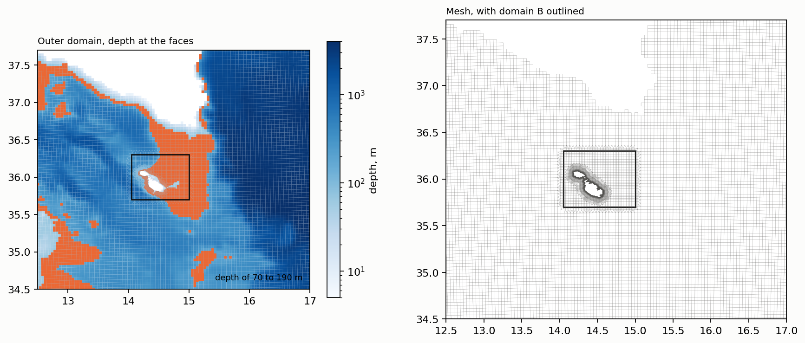
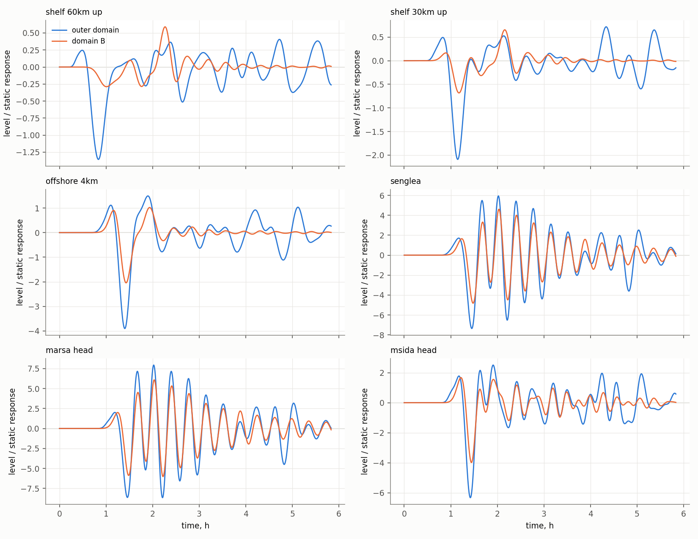
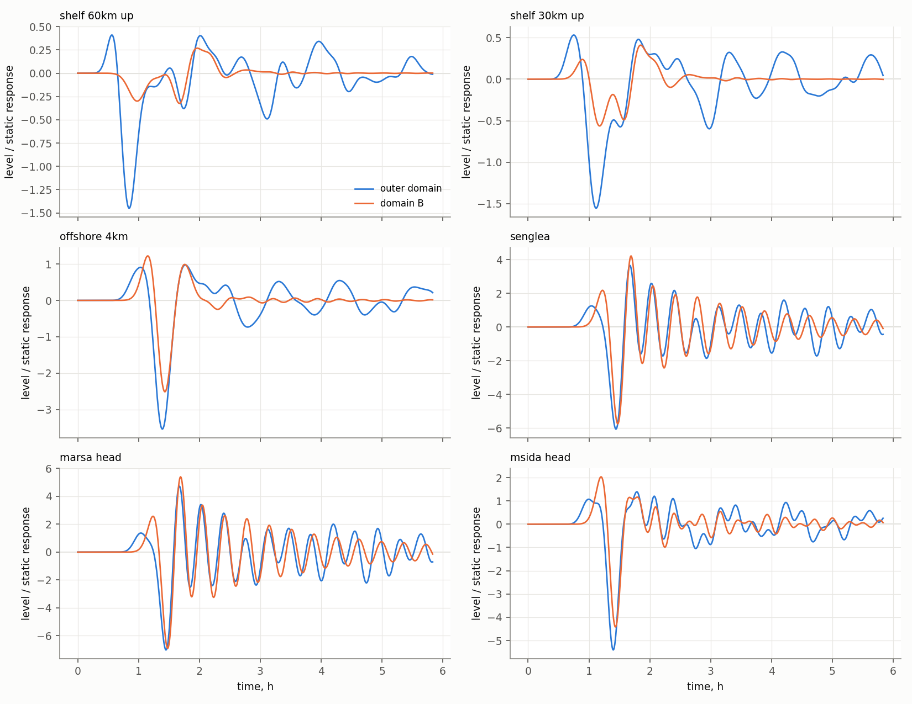
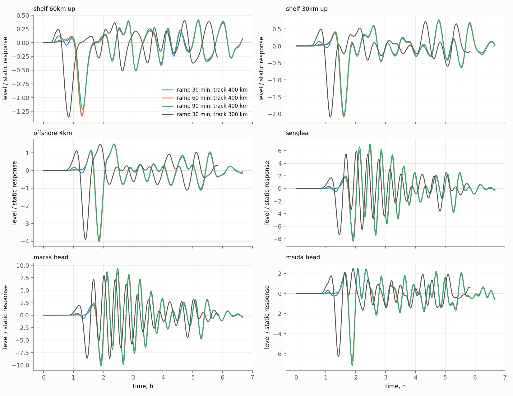

# Pilot scenarios of the long-wave sweep on the outer domain

*Run 9 October 2026 on D-Flow FM 2026.01 (dflowfm-cli, serial, Windows). Outer mesh built by `scripts/build_mesh_outer.py` on the bathymetry retrieved by `scripts/download_emodnet_channel.py`. Scenarios built and run by `scripts/build_longwave_scenario.py`, analysed by `scripts/analyse_longwave_scenario.py`. Figures `figures/mesh_outer01.png`, `figures/longwave_pilot_h180.png`, `figures/longwave_pilot_h270.png` and `figures/longwave_pilot_ramp.png`. Meshes and model inputs are regenerated by the scripts and are not versioned.*

The idealised tests of [moving_pressure_channel_test.md](moving_pressure_channel_test.md) show that a domain of the size of domain B does not contain the generation of the long wave. The pilot below builds an outer domain over the Sicily Channel, runs one moving pressure disturbance from two directions on it and on domain B, and measures what the smaller domain loses on the real bathymetry.

---

## 1. Outer domain and mesh

The outer domain covers 12.5 to 17.0 E and 34.5 to 37.7 N, 419 by 361 km. Its mesh is the quadtree of the working mesh, version 02, with one coarser level, a base cell of 3840 m that halves to 1920 m over the box of domain B, inside which the zones of version 02 are imposed unchanged. Land outside the Maltese Islands is taken from the EMODnet grid, and bed level from the MEPA 10 m grid, the EMODnet shelf grid and the EMODnet grid of the channel, in that order.

*Depth at the faces of the outer mesh, with the depths of 70 to 190 m in orange (left), and the mesh with domain B outlined (right).*

| Quantity | Outer mesh | Version 02 |
|---|---|---|
| Extent | 419 × 361 km | 86 × 66 km |
| Faces | 35 839 | 26 766 |
| Faces of 3840 m | 8671 | none |
| Open boundary cells opened by FM | 346 | 164 |
| Largest depth | 4057 m | 190 m on the plateau |
| Wall time for 5.83 simulated hours, step limited to 5 s, six runs side by side | 235 s | 181 s |

The depths at which a disturbance of 94 to 155 km/h is resonant, 70 to 190 m, form a plateau between Malta and the southeastern coast of Sicily, some 90 km from north to south and 60 to 100 km from west to east, with further areas on the Adventure Bank to the west and on the banks south of 35.3 N. East of 15.3 E the Malta Escarpment falls to more than 3000 m. Domain B holds the southern third of the plateau.

The mesh serves two-dimensional barotropic runs. The three-dimensional runs remain on domain B.

---

## 2. Scenario

A pressure rise of 200 Pa, whose static response is 1.99 cm, of Gaussian shape with a standard deviation of 15 km along its track and 50 km across it, travels at 31 m/s, the long-wave celerity at 98 m, along a straight track of 300 km centred on the Valletta harbours. The amplitude is raised over the first 30 minutes and lowered over the last 30, so that the disturbance exists inside the outer domain alone. The run continues for three hours after the disturbance is lowered. Two tracks are run, one arriving from the north across the plateau and one arriving from the east across the escarpment, each on the outer mesh and on version 02 with the same pressure field.

The run is two-dimensional and barotropic, with a Riemann boundary forced by zero and no forcing other than the pressure. **The tide-generating potential is switched off**, `tidalForcing = 0`. D-Flow FM applies it by default on a spherical mesh, and over the outer domain it raises the level by 1.1 to 1.8 cm within the run with no pressure rise at all, which is the size of the static response. With the potential off the same run stays at rest to four decimal places of a centimetre.

Stations are placed at the nearest cell centre whose nodes all lie at least 1 m below zero. At the heads of Marsa, Sliema Creek and Msida Creek the nearest cells to the intended points carry bed levels above zero, a consequence of the gaps of the 10 m grid already recorded for the mesh, and the stations there stand 130, 57 and 261 m from the intended points.

---

## 3. Response and the loss on domain B

*Water level in units of the static response for the disturbance arriving from the east, on the outer domain and on domain B, at two points of the shelf 60 and 30 km up the track, 4 km off the harbours, and at Senglea, the head of the Grand Harbour at Marsa and the head of Msida Creek.*

*The same stations for the disturbance arriving from the north.*

Peaks are the largest departure from rest in units of the static response. The period is that of the largest spectral peak between 5 and 120 minutes on the outer domain.

| Station | From the north, peak | Period, min | Domain B / outer | From the east, peak | Period, min | Domain B / outer |
|---|---|---|---|---|---|---|
| Shelf, 60 km up the track | 1.45 | 117 | 0.22 | 1.36 | 51 | 0.44 |
| Shelf, 30 km up the track | 1.55 | 112 | 0.36 | 2.09 | 76 | 0.33 |
| 4 km off the harbours | 3.54 | 74 | 0.71 | 3.90 | 48 | 0.52 |
| Grand Harbour, mouth | 4.27 | 74 | 0.81 | 4.91 | 22.6 | 0.58 |
| Senglea | 6.07 | 21.7 | 0.95 | 7.36 | 22.4 | 0.65 |
| French Creek | 6.30 | 21.7 | 0.96 | 7.64 | 22.4 | 0.66 |
| Dockyard Creek | 5.72 | 21.9 | 0.93 | 6.85 | 22.4 | 0.64 |
| Marsa, head of the Grand Harbour | 7.02 | 21.7 | 0.98 | 8.66 | 22.4 | 0.70 |
| Marsamxett, mouth | 4.30 | 74 | 0.77 | 4.93 | 48 | 0.58 |
| Sliema Creek | 4.94 | 74 | 0.80 | 5.78 | 48 | 0.61 |
| Msida Creek, head | 5.41 | 74 | 0.82 | 6.31 | 48 | 0.63 |
| Pietà Creek, head | 5.14 | 74 | 0.81 | 5.98 | 48 | 0.62 |

Four readings follow, each from two scenarios of one disturbance and to be taken as indications.

**Loss on domain B.** On the shelf domain B returns between a fifth and a half of the peak of the outer domain. Inside the harbours the loss depends on the direction. For the disturbance from the east it is 30 per cent or more at every station. For the disturbance from the north it is 2 to 7 per cent inside the Grand Harbour, where the response is the ringing of the basin excited as the disturbance passes overhead, and some 20 per cent in Marsamxett, which follows the slower oscillation of the shelf. A sweep on domain B would therefore distort the dependence on direction, which is the quantity the sweep is meant to give.

**Amplification along the chain.** On the outer domain the peak is 1.4 to 2.1 times the static response on the shelf, 3.5 to 3.9 times at 4 km from the harbours, 4.3 to 4.9 times at the mouths and 5.7 to 8.7 times inside the Grand Harbour, that is 11 to 17 cm for a rise of 2 hPa.

**The Grand Harbour rings at 22 minutes.** Senglea, French Creek, Dockyard Creek and Marsa oscillate together at 21.7 to 22.4 minutes for hours after the passage. The dominant peak of the Senglea record is at 23.0 minutes ([senglea_spectrum.md](senglea_spectrum.md)), against 14.5 to 18.4 minutes for the fundamental mode in the one-dimensional estimate ([basin_modes.md](basin_modes.md)). The two-dimensional model on the measured bathymetry thus places the response of the basin close to the observed peak, which favours the reading that the 23-minute peak is the fundamental mode of the Grand Harbour and that the one-dimensional estimate is short. The spatial structure of the mode has not been examined.

**Marsamxett follows the shelf.** Its stations peak with the oscillation of 48 to 74 minutes that also dominates off the harbours, within the milgħuba band of 0.2 to 2 cph, and reach 5 to 6.3 times the static response at the heads of Msida and Pietà Creeks.

---

## 4. Numerical settings, ramp and linearity

**Time step.** For the disturbance from the north on the outer mesh, the peaks at a largest step of 5 s equal those at 2 s to two decimal places at every station, and those at 30 s are lower by up to 2 per cent. The currents of these scenarios are weak, so the step is set by the limit imposed and not by the advective condition that gave 3.7 s under a resonant wave of 2 m in the acceptance run of the mesh. At 5 s a scenario of 12 simulated hours takes some 7 to 8 minutes, and the 96 scenarios of the proposed sweep some 12 hours in series, or a few hours with several run side by side.

**Ramp and length of the track.** The disturbance from the east is repeated on a track of 400 km with ramps of 30, 60 and 90 minutes.

*Water level in units of the static response for the disturbance from the east, with ramps of 30, 60 and 90 minutes on a track of 400 km and with a ramp of 30 minutes on a track of 300 km. The records of the longer track are later by the additional 50 km of approach.*

| Track and ramp | Crest ahead of the disturbance, 60 km up the track | Peak at Senglea | Peak at the head of Msida Creek |
|---|---|---|---|
| 300 km, 30 min | 0.25 | 7.36 | 6.31 |
| 400 km, 30 min | 0.12 | 7.60 | 6.75 |
| 400 km, 60 min | 0.12 | 7.89 | 6.70 |
| 400 km, 90 min | 0.10 | 8.40 | 7.19 |

The free wave released while the amplitude is raised reaches the shelf ahead of the disturbance as a crest of a quarter of the static response on the track of 300 km and of a tenth to an eighth on the track of 400 km. On the longer track the ramps of 30 and 60 minutes agree within 4 per cent at every station. The ramp of 90 minutes gives peaks up to 11 per cent higher inside the harbours, since on a track of 3.6 hours it begins to lower the disturbance 17 minutes after the passage over the harbours. A track of 400 km with a ramp of 60 minutes is retained for the sweep.

**Linearity.** The disturbance from the east is repeated with rises of 1000 and 3000 Pa.

| Station | 1000 Pa / 200 Pa | 3000 Pa / 200 Pa |
|---|---|---|
| Shelf and 4 km off the harbours | 1.00 | 1.00 |
| Grand Harbour, mouth | 0.99 | 0.98 |
| Senglea, French Creek, Dockyard Creek, Marsa | 0.98 | 0.93 to 0.94 |
| Marsamxett, mouth and inlets | 1.00 | 0.99 to 1.01 |

The ratios are of peaks in units of the static response of each run. The response is proportional to the pressure rise within 2 per cent up to 10 hPa, five times the rise of the pilot and above the jumps of 1 to 5 hPa typical of meteotsunami events, and departs by 6 to 7 per cent inside the Grand Harbour at 30 hPa, where the ringing reaches 2 m. A single amplitude is therefore sufficient for the sweep.

---

## 5. Matters open after the pilot

- **Persistent oscillation of the shelf.** On the outer domain the shelf stations continue to oscillate at 50 to 120 minutes, with some 0.4 of the static response, three hours after the passage, and alike for every ramp. Whether this is a mode of the plateau between Malta and Sicily or a return from the open boundary is to be separated, by the pattern of the oscillation and by a run on a still larger domain.
- **Width and speed.** One width and one speed were run. The dependence on both is the object of the sweep.
- **Bed level at the heads of the inlets.** The cells above zero at Marsa, Sliema Creek and Msida Creek keep the stations away from the heads, which are the points of interest for flooding.
- **Structure of the 22-minute oscillation.** A map of amplitude and phase over the Grand Harbour would establish whether it is the fundamental mode of the basin.
