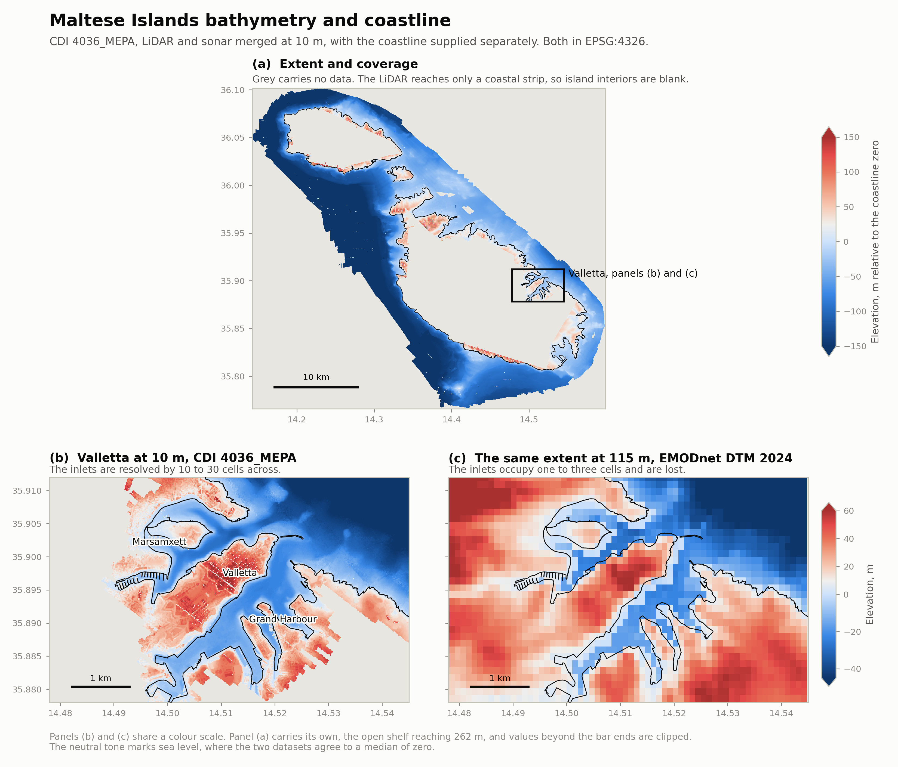

# Bathymetric dataset CDI 4036_MEPA: contents, specifications and fitness for purpose

*Received from Prof. Adam Gauci on 22 September 2026 as `4036Mepa.zip` (3.9 MB). Extracted to `data/raw/mepa_4036/`. Assessed 23 September 2026.*

The dataset constitutes the native-resolution source from which the EMODnet Digital Bathymetry is derived in Maltese coastal waters, where it is registered under CDI identifier `4036_MEPA` and attributed to EDMO 708, the Oceanography Malta Research Group of the University of Malta.

---

## 1. Contents

The archive contains two raster datasets in ESRI ArcInfo binary grid format, each accompanied by an `info/` directory and the associated `hdr.adf`, `prj.adf`, `w001001.adf` and `vat.adf` components.

| Grid | Dimensions | Extent (ED50 / UTM 33N) | Value range | Valid cells | Acquisition method |
|---|---|---|---|---|---|
| `lid_sbed` | 3710 x 3397 | E 426754–463854, N 3959860–3993830 | -50 to +150 m | 12.2% | Airborne LiDAR, seabed and terrestrial topography combined |
| `son_sbed` | 4085 x 3727 | E 422872–463722, N 3958364–3995634 | -262 to 0 m | 26.8% | Vessel-mounted sonar, seabed only |

Both grids have a cell size of 10 m, are stored as signed 16-bit integers, and use -32768 to denote absent data. Their combined extent covers Malta, Gozo and Comino.

The two datasets are complementary rather than redundant. The LiDAR survey penetrates shallow water of sufficient clarity and additionally records the land surface, whereas the sonar survey covers navigable and deeper water. Coverage over the Valletta harbours illustrates the complementarity.

| Window | Sonar alone | LiDAR alone | Merged |
|---|---|---|---|
| Grand Harbour | 43.1% | 74.7% | 86.0% |
| Marsamxett | 24.1% | 72.6% | 75.2% |

A merged product is therefore required, with sonar values given precedence where both are present, on the grounds that sonar constitutes a direct measurement of the seabed. Because `lid_sbed` extends to +150 m, the merge also supplies the terrestrial surface required for shoreline and quay representation.

---

## 2. Coordinate reference system

The metadata identifies the projection as `ED_1950_UTM_Zone_33N` on the geographic system `GCS_European_1950`, corresponding to EPSG:23033.

The accompanying `prj.adf` does not encode the datum name. GDAL consequently reports the coordinate system as *"unnamed, Unknown datum based upon the International 1924 ellipsoid (deprecated)"* and attaches no EPSG code. Since the projection parameters of ED50 / UTM 33N and WGS84 / UTM 33N (EPSG:32633) are identical, the two are indistinguishable from the file alone.

The consequence of the substitution was quantified at a point within the Grand Harbour. Interpreting ED50 coordinates as WGS84 displaces the data by 70.7 m in easting and 183.9 m in northing, a total offset of 197 m, equivalent to approximately 20 cells at the native resolution. This exceeds the width of most inlets in both harbours. The resulting field would place bathymetry on the incorrect side of quay structures and would fail to close the shoreline, and no error condition would be raised.

The coordinate reference system must therefore be assigned explicitly as EPSG:23033 on opening, rather than inferred from the file. Reprojection to WGS84 requires a datum transformation and not an affine conversion alone; `pyproj` performs this correctly when both systems are specified by EPSG code.

---

## 3. Vertical datum

The vertical reference is recorded in the files, contrary to an earlier assessment in this document which stated that it was absent. The earlier statement was based on a search using FGDC element names against metadata written in the ESRI schema, and it missed the declaration.

Both `prj.adf` files carry the reference in a trailing comment:

```
Zunits        METERS /* ETRS_1989 - VCS# = 115701
```

and the `peXml` element of each `metadata.xml` carries it in full within the WKT:

```
VERTCS["ETRS_1989",
       DATUM["D_ETRS_1989",SPHEROID["GRS_1980",6378137.0,298.257222101]],
       PARAMETER["Vertical_Shift",0.0],
       PARAMETER["Direction",1.0],
       UNIT["Meter",1.0]]
```

with `VCSWKID` 115701. The declaration is therefore **ETRS89 ellipsoidal height**, referenced to the GRS80 ellipsoid with no vertical shift.

**The declaration is inconsistent with the data and should not be acted upon.** Ellipsoidal heights in the central Mediterranean exceed orthometric heights by several tens of metres, the geoid lying well above the ellipsoid in this region. Were the values ellipsoidal, the sea surface would occupy a positive elevation of that order and the emerged terrain would be correspondingly displaced. Two independent tests establish that they are not.

**Control points.** The peninsula of Valletta returns +57.6 m against an actual elevation of approximately 50 to 56 m above mean sea level, and Floriana returns +36.4 m against approximately 40 m. Both are consistent with orthometric heights and neither admits the addition of a geoid separation.

**Agreement with the coastline.** The elevation of the merged product was sampled at 11,884 points along the coastline supplied separately by the host group, which is itself the zero contour of a terrestrial contour dataset. The median elevation along that boundary is **+0.00 m**. Were the two referenced to different vertical surfaces the median would be displaced by the difference between them. The test is set out in [coastline_dataset.md](coastline_dataset.md).

The values are therefore orthometric, referenced to a surface approximating mean sea level, and the declared VERTCS is an inherited ArcGIS default rather than a description of the data. The practical consequence is that the field may be used directly against water levels referenced to mean sea level, and that no geoid correction is to be applied.

**What remains to be established** is which realisation of mean sea level is involved, and specifically how the zero of this surface relates to the zero of the tide gauges against which the model will be validated. That relationship, rather than the identity of the datum in the abstract, is what a water-level study requires. The question is now addressed to the source contour dataset `ContoursMalta`, identified through the coastline provenance.

---

## 4. Resolution relative to the public product



*Extent and coverage of the merged 10 m bathymetry with the coastline (a), the Valletta harbours at 10 m (b), and the same extent in the EMODnet DTM 2024 at 115 m (c).*

EMODnet publishes the same survey resampled to a grid of 1/16 by 1/16 arc-minute, approximately 115 m. The difference in the number of resolved water cells over the two harbours is given below, together with the representation of inlet widths.

| Measure | EMODnet (115 m) | MEPA (10 m) | Ratio |
|---|---|---|---|
| Grand Harbour, water cells | 222 | 38,619 | 174 |
| Marsamxett, water cells | 77 | 19,732 | 256 |
| Inlet of 100 m width | 0.9 cells | 10 cells | |
| Inlet of 300 m width | 2.6 cells | 30 cells | |

The inlets constitute the resonating elements of the harbour system. At 115 m their modes were absent from any solution that could be constructed, and their absence would not have been signalled by the model. At 10 m they are adequately represented. The principal risk identified in the project plan is accordingly resolved, and the reduced scope that risk had imposed is no longer necessary. Marsamxett can be retained within the modelled domain and the inlet-scale modes return to scope.

---

## 5. Processing lineage

The ArcGIS processing history recorded in the respective `metadata.xml` files documents the derivation of both grids.

For `son_sbed`:

```
MosaicToNewRaster  J:\RefDATA\Vessel_Seabed_Pt1_Dec2012\DTM_2m\422_3989.asc; ...
Resample           Sonar_Seabed_All_2m -> Son_Sbed_10m  10  NEAREST
```

For `lid_sbed`:

```
MosaicToNewRaster  J:\RefDATA\LIDAR_Terr_Seabed\Seabed_Topography\DSM_2m\426_3989_seabed_and_topo_2m.asc; ...
Resample           Lidar_Seabed_Topo_2m -> lid_sbed_10m  10  NEAREST
```

Three observations follow. First, both grids derive from mosaics at 2 m resolution and the supplied products are nearest-neighbour resamples of those mosaics. A 2 m dataset therefore exists for both. Second, the sonar campaign is identified as a vessel survey designated Part 1 and dated December 2012, which raises the question of whether a subsequent part exists and whether any resurvey has been undertaken in an actively dredged commercial port over the intervening period. Third, the compilation path `AMicallef_Bathydata` attributes the assembly to Aaron Micallef, which is relevant both for citation and for locating the original survey documentation.

Processing was performed under ArcGIS 10.0 on Windows Server 2008 R2, placing the compilation in the early to middle part of the 2010s.

---

## 6. Limitations

**Residual coverage gaps.** The merged product leaves 14.0% of the Grand Harbour window and 24.8% of the Marsamxett window without data in either grid. A substantial proportion of this lies inland, beyond the coastal strip covered by the LiDAR survey, and is immaterial. A further proportion is not: gaps are visible at the inner extremity of Marsamxett in the vicinity of Msida and Pietà. Prior to mesh construction the gaps must be intersected with an independent coastline so that unmapped water is distinguished from ordinary land, after which the need for and extent of interpolation can be established.

**Resampling method.** Nearest-neighbour resampling from 2 m preserves individual values rather than averaging them, so isolated extremes present in the source mosaics propagate unchanged into the 10 m product. A despiking pass was tested and is **not** applied to the merged product, for reasons given in Section 8.

**Depth extremes.** The Grand Harbour extraction window reaches 53 m and the full sonar grid reaches 262 m, both attributable to water beyond the harbour entrances. Windows must be clipped to the basins before any summary statistic is computed, since otherwise the resulting values describe the open shelf rather than the harbour.

---

## 7. Outstanding queries for the host group

1. **Levelling datum of the source contours.** Section 3 establishes that the values are orthometric and that the declared ETRS89 ellipsoidal VERTCS is a mislabel. What remains is the identity of the levelling datum, approached through the `ContoursMalta` dataset from which the coastline was derived, and above all its relation to the zero of the tide gauges used for validation.
2. **Availability of the 2 m products**, from which both supplied grids were resampled.
3. **Existence of a Part 2** of the December 2012 vessel survey, and of any resurvey undertaken since.
4. **Survey accuracy**, in the horizontal and the vertical, and the depth penetration limit achieved by the LiDAR survey in these waters.
5. **Licensing and attribution**, specifically what may be published and how MEPA, the University of Malta and the compiler should be credited in a manuscript and in a data availability statement.

---

## 8. Merged product

The two components were combined by `scripts/build_merged_bathymetry.py` into `data/processed/mepa_4036_merged_10m.tif`, with a geographic counterpart `mepa_4036_merged_10m_wgs84.tif`. Sonar is given precedence and LiDAR fills the remainder, contributing 770,412 cells. The union grid is 4098 by 3727 cells at 10 m in EPSG:23033, of which 31.7% carry data, comprising 4,233,597 submerged and 613,271 emerged cells.

Coverage over the two harbours in the merged product is 86.1% for the Grand Harbour window and 75.1% for Marsamxett, with median depths of 17.5 m and 14.6 m respectively.

**Verification of georeferencing.** The geographic product was sampled at seven control points of known character. The Grand Harbour entrance returns -9.0 m, the inner harbour at Marsa -16.0 m and Sliema Creek -24.6 m, all submerged as expected. Valletta returns +57.6 m, consistent with the elevation of the peninsula, and Manoel Island +8.8 m. The results are consistent with the ED50 interpretation of the source coordinates and would not be obtained under the WGS84 substitution described in Section 2.

**Despiking was tested and rejected.** A pass replacing cells departing from a 5 by 5 local median by more than 5 m flags 70,989 of 4,846,868 valid cells. The flagged population has a median local gradient of 49.5% against 7.1% for the remainder, and 7.2% of all emerged cells are flagged against approximately 1% of cells in water shallower than 20 m. The criterion is therefore identifying the coastal cliffs and the Valletta bastions, which are genuine features of the terrain, rather than artefacts of the nearest-neighbour resampling. The archival product is accordingly left unfiltered. Should despiking prove necessary, it belongs at mesh construction, restricted to the model domain and governed by a slope-aware rather than an absolute criterion.

**Depth extremes persist in the harbour windows.** The merged windows reach 74 m, which originates in water beyond the entrances included by the rectangular extraction. The requirement to clip to the basins before computing summary statistics, stated in Section 6, is unchanged.
