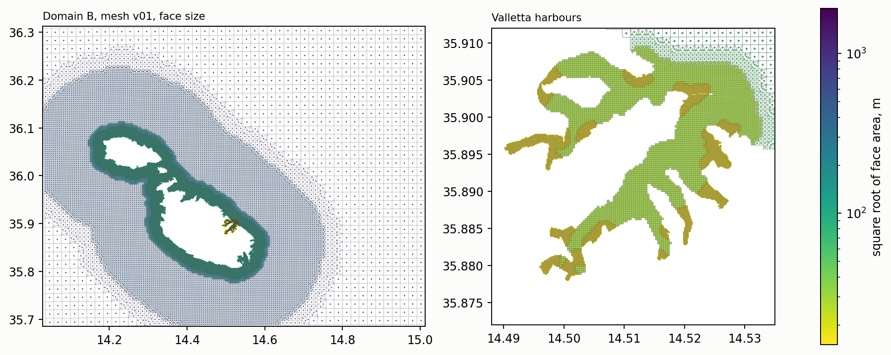

# Mesh of domain B, version 01

*Built 1 October 2026 by `scripts/build_mesh_v01.py`, tested in D-Flow FM 2026.01 by `scripts/build_mesh_smoke_test.py`. Figure at `figures/mesh_v01.png`. The mesh is written to `data/processed/mesh_v01/` and regenerated by the build script in about seventy seconds.*

---

## 1. Construction

Domain B, 14.05 to 15.00 E and 35.70 to 36.30 N as proposed in [domain_and_discretisation.md](domain_and_discretisation.md), is covered by a single quadtree refined from a base grid of 1920 m. Each zone of the sizing exercise is imposed as a polygon refined to its target edge, and a band of the intermediate level, three cells wide, separates every zone from surroundings two levels coarser.

| Zone | Target | Sizing value |
|---|---|---|
| Beyond 15 km of the coast | 1920 m | 1500 m |
| Within 15 km of the coast | 480 m | 300 m |
| Within 2 km of the coast | 120 m | 100 m |
| Valletta harbours, and 300 m around the mouth lines | 30 m | 30 m |
| Harbour channels narrower than 150 m | 15 m | 15 m |

The harbours are separated from the sea by the outer section lines of [basin_modes.md](basin_modes.md). Channel width is twice the distance to land, taken both at the nearest ridge of the distance transform and at the point itself, so that wide water whose nearest ridge belongs to a jetty is not counted as narrow. Land is removed where a cell centre falls inside a coastline polygon, and bed level is assigned at the nodes from the MEPA 10 m grid, 72 per cent of nodes, and from EMODnet elsewhere.

**The mesh is built in UTM 33N and its nodes are transformed to WGS84.** The same refinement performed in geographic coordinates produced transition triangles at the hanging nodes with an orthogonality of 1, and FM rejected the network as not orthogonal. A test grid refined in UTM and transformed has a maximum orthogonality of 0.0002 on the sphere, since the transverse Mercator projection is conformal and the transformation preserves the angles on which orthogonality depends. Only the node coordinates are transformed and the face connectivity is carried over, because rebuilding the faces from the edges on the sphere returned five additional faces.

---

## 2. Result

*Face size of mesh version 01 over domain B (left) and over the Valletta harbours (right), as the square root of the face area on a logarithmic scale.*

| Quantity | Value |
|---|---|
| Faces | 41 353, of which 4 052 transition triangles |
| Quadrilaterals at 15 / 30 / 60 m | 4 242 / 3 610 / 121 |
| Quadrilaterals at 120 / 240 / 480 m | 18 901 / 1 213 / 8 088 |
| Quadrilaterals at 960 / 1920 m | 368 / 758 |
| Orthogonality, interior edges | median 0.00005, 99th percentile 0.00011, maximum 0.553 |
| Edges above 0.01 / above 0.5 | 20 / 1 |
| Faces with mean node bed level at or above 0 m | 1 050 |
| Open boundary | one polyline of 333 points, 239 boundary cells opened by FM |

FM 2026.01 initialises on the mesh and completes two hours of still water with a Riemann boundary forced by zero in 14 s, with water level between −0.006 and +0.004 m.

---

## 3. Departures from the sizing and matters for version 02

**The mesh holds 41 400 faces against some 28 500 estimated.** Faces intersected by a zone polygon are refined with those inside it, so that every zone extends by up to one coarse cell beyond its nominal limit. The 2 km zone at 120 m accounts for 18 900 faces, nearly half the total. The time step is set by the 15 m cells and the cost per step by the face count, so a reduction of the 2 km zone or of its resolution is the first lever if the cost matters for the parametric sweep.

**One edge exceeds the FM threshold in the meshkernel measure**, at 0.553, although FM accepted the network. The two measures are not identical, which agrees with the observation recorded in StagnoneDT that the meshkernel orthogonality is not the exact criterion of FM. The edge is to be located and the margin restored.

**1 050 faces have a mean bed level at or above zero.** They are cells straddling the shore, whose land nodes carry the terrestrial elevation of the LiDAR survey. They behave as dry cells in FM and are not an error, but their distribution inside the harbours, and the gaps of the MEPA grid at the heads of Msida and Pietà Creeks noted in [mepa_4036_dataset.md](mepa_4036_dataset.md), are to be examined before the inlets are trusted.

**The other embayments with documented milgħuba**, St Paul's Bay and Xemxija, Mellieħa, Marsaskala and Marsaxlokk, are resolved at 120 m. Whether any of them requires the harbour resolution depends on the questions the study retains.

---

## 4. Computational cost and the width of the coastal zones

Three variants were built with the same harbour resolution and narrower coastal zones, by `build_mesh_v01.py --version --near-m --far-m`, and run for six hours with a long wave of 0.15 m amplitude and 25 minute period entering through the eastern boundary, near the mode of the harbours, by `build_mesh_smoke_test.py --forced`. The forcing is strong, with water level reaching ±2 m in the harbours and speed 4.3 m/s at the entrance, and the time step it imposes is therefore a lower bound.

| Variant | 120 m zone | 480 m zone | Faces | Mean time step | Wall time per step | Wall time per simulated day, serial, 2D | Largest water level |
|---|---|---|---|---|---|---|---|
| v01 | 2 km | 15 km | 41 353 | 3.7 s | 42.0 ms | 971 s | 2.07 m |
| v01b | 1 km | 5 km | 26 766 | 3.7 s | 26.4 ms | 611 s | 2.09 m |
| v01c | 1 km | 10 km | 29 993 | | | | |
| v01d | 0.5 km | 5 km | 22 719 | 3.7 s | 21.5 ms | 498 s | 2.09 m |

The time step is the same in all three, since it is set by the 15 m cells of the harbour channels, which the variants share. The cost per step is close to 1.0 µs per face, so the cost falls in proportion to the face count, and the largest water level in the harbours changes by 0.02 m. Some 12 000 faces, the 15 and 30 m cells of the harbours and their transition triangles, are common to every variant and set a floor on the count.

The campaign implied by the experimental design was costed on the following assumptions, which are stated so that they can be revised.

| Component | Assumption | Simulated days |
|---|---|---|
| Parametric sweep, 2D | 6 speeds × 8 directions × 2 widths, 12 h each, repeated for the restricted mouth | 96 |
| Renewal, 3D | present and restricted mouth, 60 days each | 120 |
| Validation hindcast and storm case, 3D | some 40 days | 40 |

The 2D cost is measured. The 3D cost is scaled from the StagnoneDT v04AE configuration, 25 200 faces with a minimum cell of 15 m, 10 sigma layers, salinity and temperature, which takes some 16 minutes of FM time per simulated day on 8 MPI processes, in proportion to the face count. The scaling assumes a comparable time step and carries an uncertainty of a factor of two.

| Variant | 2D sweep, serial total | 2D sweep, 16 runs in parallel | 3D, per simulated day, 8 MPI | 3D, 160 days, 8 MPI |
|---|---|---|---|---|
| v01 | 26 h | 1.6 h | 26 min | 70 h |
| v01b | 16 h | 1.0 h | 17 min | 45 h |
| v01d | 13 h | 0.8 h | 14 min | 38 h |

Three readings follow. **The 3D renewal runs dominate the cost, not the sweep**, by a factor of three. **The step from v01 to v01b saves 37 per cent throughout** and returns the face count to the 28 500 of the sizing exercise. **Neither variant is prohibitive**, the full campaign occupying some three days of machine time under v01 and two under v01b. The 2D cost is an upper bound, since forcing weaker than the present test allows a time step closer to the 30 s limit, by a factor of up to eight.

The levers that remain are, in order of effect, the resolution of the narrow channels, which sets the time step and would roughly halve the cost at 30 m against the requirement of four cells across a 60 m inlet, the number of sigma layers, and the coastal zones examined here.

---

**The open boundary lies 20 to 60 km from the harbours** and its corners on the open plateau, as recommended by [open_boundary_pulse_test.md](open_boundary_pulse_test.md).
