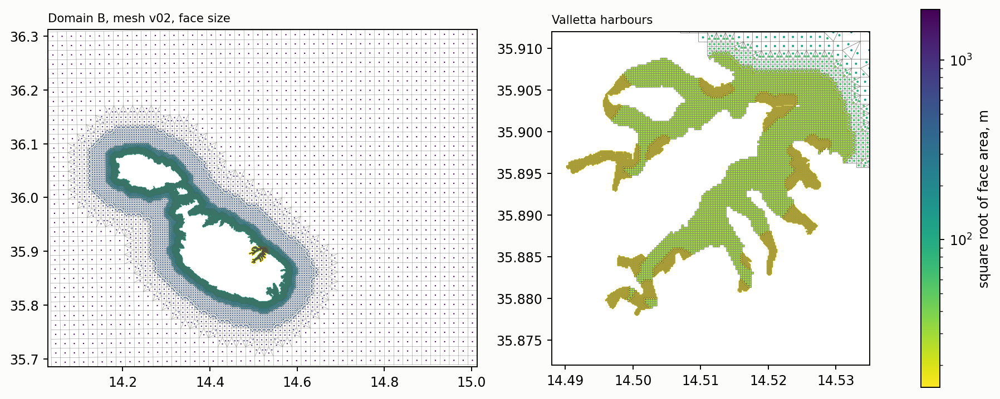

# Mesh of domain B, version 02

*Built 1 October 2026 by `scripts/build_mesh_v02.py`, tested in D-Flow FM 2026.01 by `scripts/build_mesh_smoke_test.py`. Figure at `figures/mesh_v02.png`. Written to `data/processed/mesh_v02/` and regenerated by the build script. Construction, quality and the cost comparison that selected this version are set out in [mesh_v01.md](mesh_v01.md).*

Version 02 is the working mesh of the project. It differs from version 01 only in the width of the coastal zones, 1 km at 120 m and 5 km at 480 m in place of 2 km and 15 km, and is otherwise built by the same procedure, in UTM 33N with the nodes transformed to WGS84.

*Face size of mesh version 02 over domain B (left) and over the Valletta harbours (right), as the square root of the face area on a logarithmic scale. The coastal zones are narrower than in version 01 and the harbours are unchanged.*

| Zone | Target |
|---|---|
| Beyond 5 km of the coast | 1920 m |
| Within 5 km of the coast | 480 m |
| Within 1 km of the coast | 120 m |
| Valletta harbours, and 300 m around the mouth lines | 30 m |
| Harbour channels narrower than 150 m | 15 m |

| Quantity | Version 02 | Version 01 |
|---|---|---|
| Faces | 26 766 | 41 353 |
| Mean time step under a resonant long wave | 3.7 s | 3.7 s |
| Wall time per simulated day, serial, 2D | 611 s | 971 s |
| Largest water level in the harbours, same forcing | 2.09 m | 2.07 m |
| Orthogonality, 99th percentile / maximum | 0.00012 / 0.553 | 0.00011 / 0.553 |
| Open boundary cells opened by FM | 164 | 239 |

The face count returns to the 28 500 of the sizing exercise. The harbour mesh is identical in both versions, and the matters left open in Section 3 of [mesh_v01.md](mesh_v01.md) carry over unchanged, namely the single edge at 0.553 in the meshkernel measure, the cells straddling the shore, the gaps of the MEPA grid at the heads of Msida and Pietà Creeks, and the resolution of the other embayments with documented milgħuba.
