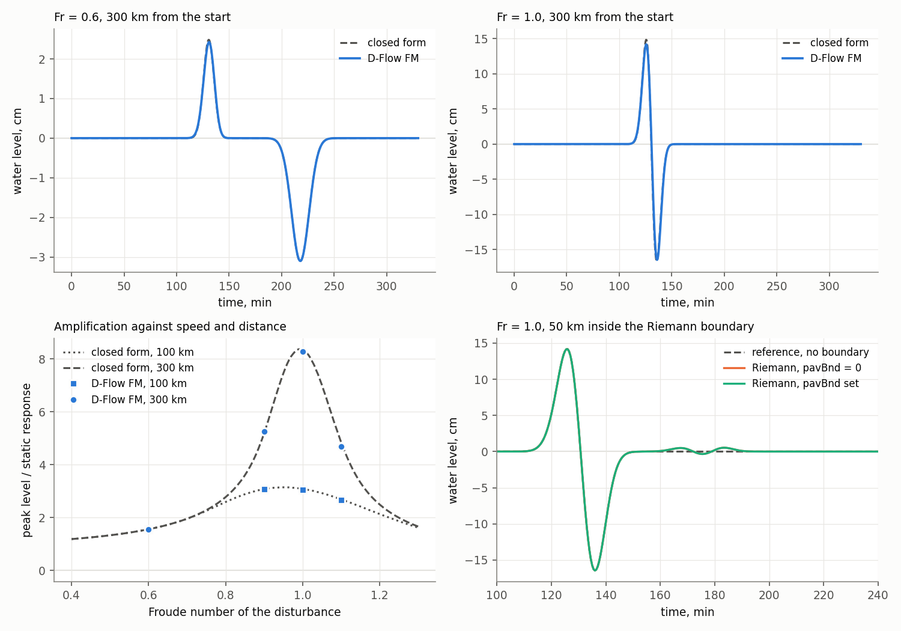
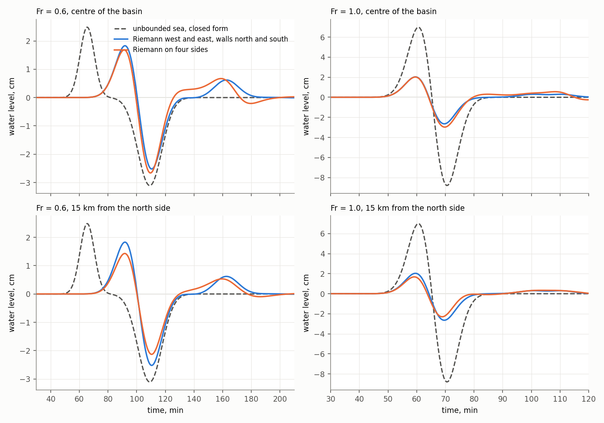

# Response of D-Flow FM to a moving pressure disturbance

*Run 9 October 2026 on D-Flow FM 2026.01 (dflowfm-cli, serial, Windows). The channel cases are built by `scripts/build_proudman_channel_test.py` and analysed by `scripts/analyse_proudman_channel_test.py`, the basin cases by `scripts/build_proudman_basin_test.py` and `scripts/analyse_proudman_basin_test.py`. Figures at `figures/proudman_channel_test.png` and `figures/proudman_basin_test.png`. The model inputs are regenerated by the build scripts and are not versioned.*

The sweep of the long wave imposes an atmospheric pressure disturbance travelling over the domain. It relies on two properties of the solver that the pulse test of [open_boundary_pulse_test.md](open_boundary_pulse_test.md) did not exercise, namely that a pressure field varying in space and time drives the sea surface as the linear theory of Proudman resonance predicts, and that the weakly reflective boundary remains transparent when the disturbance crosses it. Sections 1 to 3 measure both in a channel, and Section 4 measures what a basin of the size of domain B retains of the response when the disturbance is wider than the basin.

---

## 1. Design

A Gaussian pressure rise of 200 Pa, uniform across the channel and with a standard deviation of 11.5 km, is switched on over a fluid at rest and travels at speed U along a channel three cells wide, on a flat bed at 150 m and a mesh of 1500 m, the depth and cell size of the pulse test. The static response of the sea surface to that rise, the inverse barometer depression, is 1.99 cm, and the long-wave celerity c is 38.4 m/s. The pressure is supplied as snapshots every 30 s on a cartesian grid in a netCDF file and interpolated linearly in space and time.

In the linear frictionless limit the response has a closed form. With η_s the static response and Fr = U/c,

    η(x, t) = η_s(x − Ut) / (1 − Fr²) − η_s(x − ct) / (2 (1 − Fr)) − η_s(x + ct) / (2 (1 + Fr)),

a forced wave travelling with the disturbance and two free waves released by the start from rest. At Fr = 1 the forced wave and the forward free wave merge into a wave that grows linearly with the distance travelled,

    η(x, t) = (ct / 2) η_s′(x − ct) + η_s(x − ct) / 4 − η_s(x + ct) / 4.

Four Froude numbers are run, 0.6, 0.9, 1.0 and 1.1, each in three channels.

| Variant | East end | Purpose |
|---|---|---|
| Reference | closed wall at 951 km, not reached within the window | comparison with the closed form |
| Riemann | Riemann boundary at 351 km, `pavBnd` = 0 | signal returned when the disturbance crosses the boundary |
| Riemann with `pavBnd` | as above, `pavBnd` = 101 325 Pa | effect of the inverse barometer correction of FM at the boundary |

The window is 5.5 hours, long enough for the slowest disturbance to cross the boundary. Stations lie 100, 200 and 300 km from the starting position of the disturbance. Inside the common reach the test channels differ from the reference only by the boundary, so the difference of the two records at a station is the signal the boundary returns.

---

## 2. Response against the closed form

*Water level 300 km from the start at Froude numbers of 0.6 and 1.0, modelled and in closed form (top), peak level in units of the static response against the Froude number at 100 and 300 km (bottom left), and the record 50 km inside the Riemann boundary at Fr = 1.0 beside the reference without a boundary (bottom right).*

Peaks are in units of the static response. The last column is the root mean square departure of the modelled record from the closed form over the window, relative to the peak of the closed form.

| Fr | Station | Peak, closed form | Peak, model | Ratio | RMS / peak |
|---|---|---|---|---|---|
| 0.6 | 100 km | 1.562 | 1.560 | 0.998 | 0.022 |
| 0.6 | 200 km | 1.562 | 1.560 | 0.999 | 0.003 |
| 0.6 | 300 km | 1.562 | 1.560 | 0.999 | 0.004 |
| 0.9 | 100 km | 3.109 | 3.070 | 0.988 | 0.023 |
| 0.9 | 200 km | 4.669 | 4.702 | 1.007 | 0.006 |
| 0.9 | 300 km | 5.193 | 5.248 | 1.010 | 0.007 |
| 1.0 | 100 km | 3.123 | 3.064 | 0.981 | 0.023 |
| 1.0 | 200 km | 5.732 | 5.672 | 0.990 | 0.007 |
| 1.0 | 300 km | 8.366 | 8.275 | 0.989 | 0.010 |
| 1.1 | 100 km | 2.721 | 2.663 | 0.979 | 0.022 |
| 1.1 | 200 km | 4.221 | 4.127 | 0.978 | 0.006 |
| 1.1 | 300 km | 4.860 | 4.689 | 0.965 | 0.008 |

The modelled peak lies within 3.5 per cent of the closed form in every case and within 2 per cent in ten of the twelve, and the departure over the whole record is 1 per cent of the peak or less at 200 and 300 km and 2.2 per cent at 100 km. The subcritical forced wave, the resonant growth with distance and the supercritical case are all reproduced, so the pressure field is read and applied as intended.

Two settings of the run bear on that agreement, as measured on the resonant case.

| Setting | Peak ratio at 100, 200, 300 km | RMS / peak at 100 km |
|---|---|---|
| `Wind_eachstep` = 0, step limited to 15 s | 0.963, 0.963, 0.949 | 0.042 |
| `Wind_eachstep` = 1, step limited to 15 s | 0.968, 0.966, 0.950 | 0.025 |
| `Wind_eachstep` = 1, step limited to 5 s | 0.981, 0.990, 0.989 | 0.023 |
| `Wind_eachstep` = 1, 15 s, `teta0` = 0.5 in place of 0.55 | 0.991, 1.009, 1.015 | 0.024 |
| `Wind_eachstep` = 1, 15 s, no bed friction | 0.968, 0.966, 0.950 | 0.025 |

By default FM updates the wind and the pressure at the user time step and holds them between, which moves the disturbance in stairs, and `Wind_eachstep` = 1 updates them at every computational step. The remaining deficit of the peak at 15 s is numerical damping of the time integration, since it disappears with the implicit weighting `teta0` at 0.5 and falls to 1 per cent at a step of 5 s, a Courant number of 0.13, while bed friction at 150 m has no measurable effect. The working mesh runs near 3.7 s on cells of 1920 m over the plateau, a Courant number of 0.07, so the damping of the resonant wave offshore is expected to be below that of the 5 s case.

---

## 3. Signal returned by the Riemann boundary

The returned signal is max|test − reference| at the station 50 km inside the boundary, in units of the static response and of the peak of the reference record at the same station.

| Fr | First order, 1 / (2 (1 + Fr)) | `pavBnd` = 0 | `pavBnd` set | Returned / peak |
|---|---|---|---|---|
| 0.6 | 0.312 | 0.312 | 0.312 | 0.200 |
| 0.9 | 0.263 | 0.291 | 0.291 | 0.056 |
| 1.0 | 0.250 | 0.267 | 0.267 | 0.032 |
| 1.1 | 0.238 | 0.273 | 0.273 | 0.058 |

The boundary returns a wave of between a quarter and a third of the static response at every speed, which is larger than the 1.3 per cent it reflects of a free pulse of the same time scale. The cause lies in the formulation and not in its implementation. A boundary that admits no incoming characteristic passes a free wave, whose velocity is cη/h, whereas the wave bound to the disturbance has velocity Uη/h. The mismatch is met by a free wave sent back into the domain with amplitude (Fr − 1)/2 times the forced wave, that is the static response divided by 2 (1 + Fr) whatever the amplification, and the measured values follow that expression to within 15 per cent. The inverse barometer correction of `pavBnd` leaves the result unchanged to three figures, so it does not act on a Riemann boundary.

Relative to the wave that has grown under resonance the returned signal is small, 3 per cent at Fr = 1 after 300 km, and relative to an unamplified forced wave it is a fifth.

---

## 4. A band crossing a bounded basin

A disturbance in the milgħuba band is larger than domain B. At 110 to 140 km/h a period of 30 minutes corresponds to a length of 55 to 70 km and a period of 2 hours to 220 to 280 km, against the 86 by 66 km of the domain. In the sweep such a disturbance enters through one side, leaves through the opposite one, and cuts the two lateral sides throughout its passage.

The arrangement is tested on a square basin 90 km across, on the flat bed and mesh of the channel test. The pressure band of Section 1, uniform across its path, starts from rest 150 km west of the centre of the basin and travels east. On an unbounded sea the response is the closed form of Section 1, with the distance measured from the starting position. Each Froude number is run with Riemann boundaries on the west and east sides and closed walls on the other two, which keeps the band uniform across the basin, and with Riemann boundaries on all four sides, as in domain B.

*Water level at the centre of the basin (top) and 15 km from its north side (bottom) at Froude numbers of 0.6 and 1.0, on an unbounded sea in closed form and in the basin with Riemann boundaries on two and on four sides.*

Peaks are in units of the static response, and the last column is the peak with four Riemann sides relative to that of the unbounded sea.

| Fr | Station | Unbounded sea | Riemann west and east | Riemann on four sides | Retained |
|---|---|---|---|---|---|
| 0.6 | 30 km west of the centre | 1.56 | 0.63 | 0.70 | 0.44 |
| 0.6 | centre | 1.56 | 1.27 | 1.34 | 0.86 |
| 0.6 | 30 km east of the centre | 1.56 | 1.51 | 1.19 | 0.76 |
| 0.6 | 30 km north of the centre | 1.56 | 1.27 | 1.07 | 0.69 |
| 1.0 | 30 km west of the centre | 3.64 | 0.55 | 0.56 | 0.15 |
| 1.0 | centre | 4.43 | 1.33 | 1.49 | 0.34 |
| 1.0 | 30 km east of the centre | 5.22 | 2.02 | 2.44 | 0.47 |
| 1.0 | 30 km north of the centre | 4.43 | 1.33 | 1.16 | 0.26 |

At resonance the basin retains between 15 and 47 per cent of the peak of the unbounded sea. The wave that has grown over the 105 km travelled before the west side does not enter, since the boundary admits no incoming signal, and the wave inside the basin grows from that side as if the disturbance had started there. Below resonance, where the response does not grow with distance, between 44 and 86 per cent is retained, and the record carries a leading crest and a trailing wave that the unbounded response does not have. The lateral boundaries lower the peak by a further 15 to 20 per cent at 15 km from them and raise it slightly at the centre.

---

## 5. Consequences for the sweep

1. **The pressure field is supplied as netCDF snapshots with `Wind_eachstep` = 1.** A cartesian or geographic grid with the standard name `air_pressure` is read by the `[Meteo]` block with `interpolationMethod = linearSpaceTime`. The interval between snapshots is chosen so that the disturbance moves by a tenth of its standard deviation or less, which keeps the loss of the peak by interpolation near 0.1 per cent.
2. **The disturbance is raised and lowered inside the domain.** Each crossing of the open boundary at full amplitude releases a free wave of a quarter to a third of the static response, and a wave generated outside the domain does not enter it. The free waves released by a slow change of amplitude leave through the boundary, which passes them.
3. **Domain B does not contain the generation of the long wave.** The amplification is set by the distance travelled at resonance, 3.1 times the static response after 100 km and 8.4 times after 300 km for the width tested, and a basin of the size of domain B retains a sixth to a half of it. The sweep therefore requires an outer domain large enough for a disturbance of the band to be raised inside it and to travel the resonant depths of the shelf before reaching the harbours. Since the time step is set by the 15 m channels of the harbours, coarse cells added offshore change the cost of the sweep little.
4. **The response surface of the sweep is read on the outer domain.** Domain B remains the domain of the three-dimensional hindcast and of the renewal runs, where the forcing enters through the boundary as the CMEMS signal and the argument for stopping short of the escarpment holds.

---

## 6. Cases outside the present test

- **Oblique crossing.** A disturbance crossing the boundary at an angle combines the mismatch of Section 3 with the angular dependence of the pulse test.
- **Variable depth.** Over the plateau the depth ranges from 70 to 190 m, so a disturbance of given speed is resonant over part of its path alone, and the extent of the outer domain follows from where those depths lie.
- **Linearity in the harbours.** The tests are at 150 m and the response is linear in the amplitude of the disturbance. In the inlets, at a few metres, the assumption of a fixed amplitude in the sweep is to be checked on the working mesh.
- **The ramp of item 2 of Section 5.** Its length and its residual free waves are to be measured in the pilot scenario.
